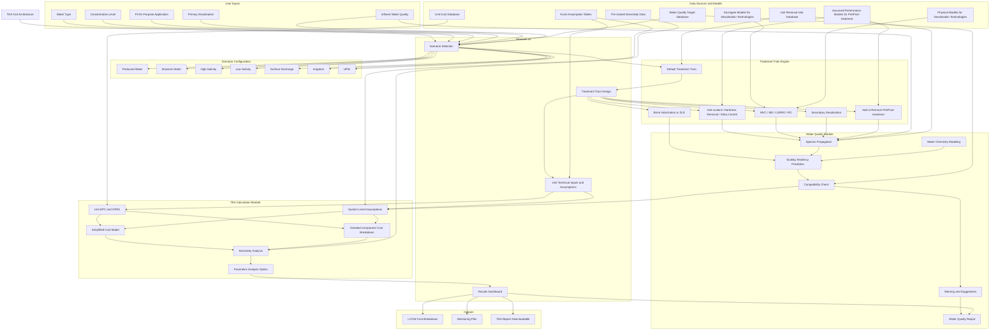

# Streamlit TEA App Architecture

```mermaid
graph TD
    Title["TEA GUI Architecture"]

    subgraph Inputs["User Inputs"]
        WaterType["Water Type"]
        ConcLevel["Concentration Level"]
        FFP["Fit-for-Purpose Application"]
        PrimaryDesal["Primary Desalination"]
        FeedWQ["Influent Water Quality"]
    end

    subgraph UI["Streamlit UI"]
        Scenario["Scenario Selection"]
        TrainDesign["Treatment Train Design"]
        UnitAssumptions["Unit Technical Inputs and Assumptions"]
        ResultsDashboard["Results Dashboard"]
    end

    subgraph Config["Scenario Configuration"]
        Produced["Produced Water"]
        Brackish["Brackish Water"]
        High["High Salinity"]
        Low["Low Salinity"]
        SurfaceDischarge["Surface Discharge"]
        Irrigation["Irrigation"]
        UPW["UPW"]
    end

    subgraph TrainEngine["Treatment Train Engine"]
        DefaultTrain["Default Treatment Train"]
        Pretreatment["Anti-scalant / Hardness Removal / Silica Control"]
        Desal["MVC / MD / LSRRO / RO"]
        SecondaryDesal["Secondary Desalination"]
        PostTreatment["Add or Remove Pre/Post-treatment"]
        Brine["Brine Valorization or ZLD"]
    end

    subgraph WaterQuality["Water Quality Module"]
        Species["Species Propagation"]
        Scaling["Scaling Tendency Prediction"]
        Compatibility["Compatibility Check"]
        Chemistry["Water Chemistry Modeling"]
        WQWarning["Warning and Suggestions"]
        WQReport["Water Quality Report"]
    end

    subgraph TEA["TEA Calculation Module"]
        CostInputs["Unit EPC and OPEX"]
        SystemAssumptions["System Level Assumptions"]
        Simplified["Simplified Cost Model"]
        Detailed["Detailed Component Cost Breakdown"]
        Sensitivity["Sensitivity Analysis"]
        Parametric["Parametric Analysis Option"]
    end

    subgraph DataSources["Data Sources and Models"]
        Excel["Excel Assumption Tables"]
        Targets["Water Quality Target Database"]
        RemovalDB["Unit Removal-rate Database"]
        CostDB["Unit Cost Database"]
        Surrogate["Surrogate Models for Desalination Technologies"]
        Physical["Physical Models for Desalination Technologies"]
        Performance["Assumed Performance Models for Pre/Post-treatment"]
        SensitivityDB["Pre-trained Sensitivity Data"]
    end

    subgraph Outputs["Outputs"]
        LCOW["LCOW Cost Breakdown"]
        Monitoring["Monitoring Plan"]
        Report["TEA Report Downloadable"]
    end

    Title --> Scenario

    WaterType --> Scenario
    ConcLevel --> Scenario
    FFP --> Scenario
    PrimaryDesal --> Scenario
    FeedWQ --> Scenario

    Scenario --> Produced
    Scenario --> Brackish
    Scenario --> High
    Scenario --> Low
    Scenario --> SurfaceDischarge
    Scenario --> Irrigation
    Scenario --> UPW

    Scenario --> DefaultTrain
    DefaultTrain --> TrainDesign
    TrainDesign --> Pretreatment
    TrainDesign --> Desal
    TrainDesign --> SecondaryDesal
    TrainDesign --> PostTreatment
    TrainDesign --> Brine

    Pretreatment --> Species
    Desal --> Species
    SecondaryDesal --> Species
    PostTreatment --> Species
    Brine --> Scaling
    FeedWQ --> Species
    Species --> Scaling
    Scaling --> Compatibility
    Compatibility --> WQWarning
    Chemistry --> Scaling
    WQWarning --> WQReport

    TrainDesign --> UnitAssumptions
    UnitAssumptions --> CostInputs
    UnitAssumptions --> SystemAssumptions
    Compatibility --> SystemAssumptions
    CostInputs --> Simplified
    CostInputs --> Detailed
    SystemAssumptions --> Simplified
    SystemAssumptions --> Detailed
    Simplified --> Sensitivity
    Detailed --> Sensitivity
    Sensitivity --> Parametric

    Parametric --> ResultsDashboard
    ResultsDashboard --> LCOW
    ResultsDashboard --> Monitoring
    ResultsDashboard --> WQReport
    ResultsDashboard --> Report

    Excel --> UnitAssumptions
    Excel --> SystemAssumptions
    Targets --> Scenario
    Targets --> Compatibility
    RemovalDB --> Species
    RemovalDB --> DefaultTrain
    CostDB --> CostInputs
    Surrogate --> Desal
    Physical --> Desal
    Performance --> Pretreatment
    Performance --> PostTreatment
    SensitivityDB --> Sensitivity
```
